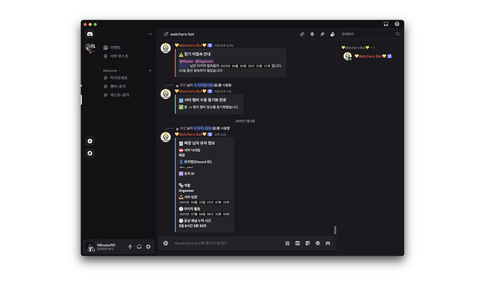

# 디스코드 멤버 관리 자동화 봇

## 개요 및 사용 기술
커뮤니티성 Discord 서버 관리 시에 발생할 수 있는 멤버 관리와 관련된 모든 작업을 자동화하기 위해 제작

- `Python`과 `MongoDB`를 이용하여 개발
- `Git` 및 `Github`을 이용하여 버전 관리
- `Google Cloud Platform`을 이용하여 배포
- 개인정보는 포함하지 않기에 보안 조치는 진행하지 않음

> `.env` 및 `config.json`은 [`configuration-file.md`](configuration-file.md)를 참고

 

## Release Version 1.0
> 최초 출시 (2025.06.01)
**기능 및 명령어**

|동작 여부|기능 요약|명령어|설명|
|------|------|-----|--|
|✅|출석 체크|`/출석-확인`|음성 채널 마지막 접속 기록 확인|
|✅|공지 메시지 ID 설정|`/멤버-공지메시지id-설정`|멤버의 공지 메시지 ID 설정|
|✅|공지 메시지 ID 설정|`/게스트-공지메시지id-설정`|서버 게스트의 공지 메시지 설정|
|✅|권한 부여|`-`|공지 메시지 확인 후 ✅ 이모지 반응 시 권한 자동 부여|
|✅|멤버 디테일|`/유저-정보`|해당 유저의 정보를 DB에서 조회 후 제공|
|✅|출석 체크|`/출석-확인`|음성 채널 마지막 접속 기록 확인|
|✅|서버 동기화|`/서버동기화`|현재 서버에 있는 모든 멤버의 정보를 최신화|
|✅|음성 채널 체류 시간|`/음성-리더보드`|해당 유저가 서버 내 전체 음성 채널에서 보낸 총 시간을 반환|

 

## Release version 1.1(Bug Fix)

> **Issue** 발생으로 개정 버전으로 수정 배포 진행

|카테고리|이슈 내용|중요도|이슈 상태|문제 버전|
|-----|-------|-----|-------|------|
|/유저-정보|마지막 활동 시간이 `잘못된 시간`으로 반환|`긴급`|`Done`|1.0|
|/서버동기화|탈퇴 멤버에 대한 목록 업데이트 안됨|`일반`|`2.0`에 통합 출시|1.0|

 

## Release Version 2.0
> 최초 출시 (2025.07.03)
**기능 및 명령어**

|동작 여부|기능 요약|명령어|설명|
|------|------|-----|--|
|✅|서버 동기화|`/서버동기화`|1주에 1번 자동으로 실행, 결과 보고|
|✅|역할 별 명령어 제한|`-`|권한별 사용할 수 있는 명령어 제한, `RBAC` 도입|
|✅|탈퇴 멤버에 대한 추적|`-`|서버 탈퇴 멤버를 DB 상 전용 Collection으로 `copy`-`paste`|
|✅|장기 미접속 알림|`-`|마지막 접속 시간 기준 14일 & 30일 동안 접속 없을 경우 관리자에게 알림|

 

## Release Version 3.0
> 추후 출시 예정(미정)

- [ ] 코드 전체 Refactoring 진행
- [ ] 멤버가 직접하는 출석 체크
- [ ] 주간 채널 체류 시간 랭크제 도입
